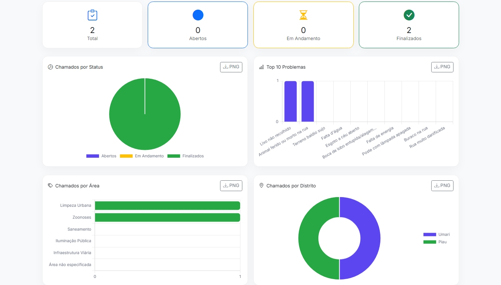
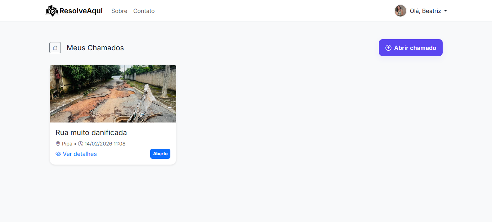

# ResolveAqui# 📋 ResolveAqui

## 🎯 Sobre
**ResolveAqui** é um sistema municipal de chamados desenvolvido em Django.  
Permite que cidadãos de uma localidade registrem problemas urbanos e acompanhem o andamento, enquanto gestores monitoram, comentam e atualizam os chamados.

---

## 🔑 Funcionalidades

### 👥 Usuários
- Criação de chamados  
- Comentários em chamados  
- Acompanhamento de status  

### 🛠️ Chamados
Cada chamado possui:
- problema (lista pré-cadastrada)  
- data de criação  
- descrição  
- foto  
- localidade  
- endereço  
- status  

### 🧑‍💼 Gestores
- Alterar status dos chamados  
- Adicionar comentários  
- Visualizar métricas e andamento em gráficos (Chart.js)

---

## 🖼️ Screenshots

### 📊 Painel do Gestor (Gráficos)

### 🎫 Área do Usuário (Chamados)

## 🗄️ Stack

- Django
- Bootstrap 5
- Chart.js
- SQLite (dev)
- Pillow

## 🚀 Status do Projeto

### ✅ Funcionalide principal concluída
### 🔧 Pendências:
- Implementação de testes
- Refatorações pontuais
- Modo escuro (dark mode)

 